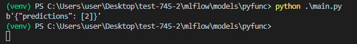
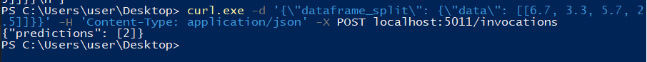

## Tracking + registrazione + caricamento modello Scikit-learn come funzione python + serving

Nell'ambiente virtuale si installano innanzitutto le seguenti librerie:

```
mlflow
virtualenv
gunicorn # per il serving
waitress # per il serving
ipykernel # non necessario
```

Avvio del server MLflow.
```
cd mlflow/
mlflow server --host 127.0.0.1 --port 5000
```
Questo comando implicitamente pone:
- `--backend-store-uri` pari a `./mlruns` cioè salva le run + i METADATI di ciascuna versione dei MLflow Model all'interno della cartella. **NOTA**: si potrebbe anche esplicitare una stringa di connessione SQLAlchemy per salvare in un database creato con MySql o SQLite.
- `--artifacts-destination` pari a `./mlartifact` cioè salva gli artefatti + i MLflow Model dentro la cartella.

Nel file `mlflow/models/regr_logistic.py` si crea un modello con scikit learn. Si chiama la funzione creata appositamente `set_experiment_run` che:
- logga la run
- logga il modello come un MLflow Model avente flavor sklearn e (in automatico) anche python_function (fonte: https://mlflow.org/docs/latest/models.html#how-to-save-model-as-python-function). Questo è anche visibile nel file yaml.
- lo registra nel model registry incrementando il numero di versione (se in passato era già stato registrato un modello con stesso nome).


Nel file `mlflow/models/pyfunc/regr_logistic_pyfunc.py` si carica dal server il modello avente uri `models:/model1_for_iris/3` come una funzione python e si fa una predizione.

**importante specificare il tracking uri** con `mlflow.set_tracking_uri("http://127.0.0.1:5000")`

## Serving

**Server**

Posizionarsi in una qualunque cartella.

```
$env:MLFLOW_TRACKING_URI = "http://127.0.0.1:5000"
Get-Childitem env:    # per verificare

mlflow models serve --model-uri models:/model1_for_iris/3 --port 5011 --no-conda
# oppure
mlflow models serve --model-uri models:/model1_for_iris/3 --port 5011 --env-manager local
```

**Client** tre modi per richiedere la predizione
- ```
  import requests
  headers = {
    'Content-Type': 'application/json',
  }
  
  json_data = {
    'dataframe_split': {
        'data': [
            [
                6.7,
                3.3,
                5.7,
                2.5,
            ],
        ],
    },
  }
  
  response = requests.post('http://localhost:5011/invocations', headers=headers, json=json_data)
  
  print(response.content)
  ```
  
- escape dei doppi apici con curl
- Richiesta post con firefox


