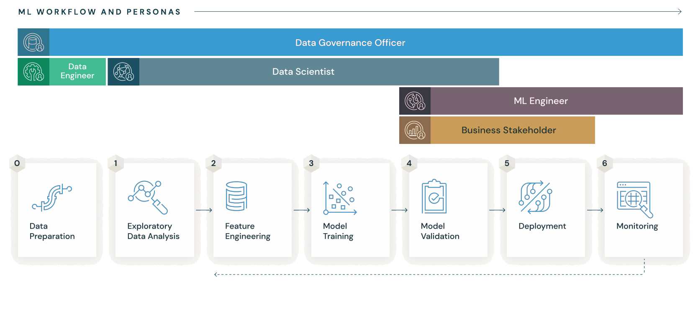

# MLFlow

Con MLFlow noi possiamo monitorare e interagire il ciclo di vita di un progetto ML.

## Ciclo di vita



**Data preparation**: ricerchiamo, raccogliamo, monitoriamo dati, risorse, esperimenti
correlate al nostro progetto ML. Risorse sono "grezze".

**Data analysis esplorativa**: indichiamo in che contesto si pone il nostro progetto ML:
che problema risolve, quale task rende più efficiente. Magari spearando le aree geografiche in cui i dati si riferiscono, analizzando  delle prime "tendenze" tra i dati raccolti...

**Feature engineering**: inizia la fase di "purificazione" dei dati raccolti. Ingegnerizziamo
nuove feature, rimuoviamo alcune. Studiamo il dominio di ciascuna feature ecc...

**Model training**: quali task di classificazione/regressione si intende fare. Quali sono i
modelli che meglio possono gestire i dati. Fase che TIENE CONTO SOLAMENTE DEGLI ESEMPI "OFFLINE".
Magari si presume che quando il modello verrà pubblicato e reso pronto per gli esempi "ONLINE",
questi siano distribuiti come gli esempi "OFFLINE". Ma non abbiamo la certezza.

**Model validation**: calcolo delle performance dei modelli addestrati. Confronto.

**Deployment**: il modello viene messo in esecuzione nell'ambiente che è quello utilizzato dall'organizzazione. Non ci aspetteremo che l'ambiente su cui il modello girerà sarà lo stesso ambiente nel quale è stato sviluppato. Possono cambiare le versioni delle librerie (perchè magari un software dell' organizzazione è stato sviluppato su questa versione specifica). Si parla di **stage**, cioè un' operazione automatizzata di recupero librerie, configurazioni ecc.. (approfondire). Si può creare un'astrazione del modello, cioè può essere visto come una funzione
python. 

**Monitoring**: Come si comporta il modello sulle istanze "online"? Operazione fondamentale perchè
ad esempio quando si verificano avvenimenti importanti (pandemie ecc...) gli esempi online possono
cambiare distribuzione. Un modello che era risultato ottimo, ora può diventare inutile.

## MLflow Tracking Step1: interfaccia semplice con il MLflow Tracking Server

https://mlflow.org/docs/latest/getting-started/intro-quickstart/index.html

```
cd mlflow_lab
```
```
mlflow server --host 127.0.0.1 --port 8080
```

A questo punto creiamo il file `/models/regr_logistic.py`.

Cosa creare:
- codice sorgente del modello (es. un oggetto di una classe offerta da scikitlearn)
- tutte le possibili combinazioni di iperparametri

Cosa memorizzare:
- (per ogni combinazione di iperparametri impiegata) quali sono metriche di performance + valori delle metriche
  
Poi dobbiamo creare l'oggetto **MLflow Model**. Questo oggetto è associato alla tipologia di modello e alla particolare combinazione di iperparametri.
1. avviare una run di MLflow.
2. loggare quanto memorizzato
3. creare una firma = come si comporta il modello = TS + predizioni

```
with mlflow.start_run():
    mlflow.log_params(params)
    mlflow.log_metric("accuracy", accuracy)

    mlflow.set_tag("Training Info", "Basic LR model for iris data")

    signature = infer_signature(X_train, lr.predict(X_train))
    ...
```

**&rarr; Cosa creare + run di MLflow + firma del modello = MLflow model**

**&rarr; A cosa serve un MLflow Model? A eseguire un esperimento**

Se il modello è un oggetto di una classe offerta da scikitlearn:

```
    ...
    model1_info = mlflow.sklearn.log_model(
            sk_model=lr,
            artifact_path="iris_model",
            signature=signature,
            input_example=X_train,
            registered_model_name="tracking-quickstart",
    )
```

Per astrarre il modello creiamo il file `/models_pyfunc/regr_logistic_pyfunc.py`.

```
loaded_model1 = mlflow.pyfunc.load_model(model1_info.model_uri)

predictions = loaded_model1.predict(X_test)

iris_feature_names = datasets.load_iris().feature_names
result = pd.DataFrame(X_test, columns=iris_feature_names)

result["actual_class"] = y_test
result["predicted_class"] = predictions
```
Eseguiamo quest'ultima parte di codice, e nella dashboard verrà aggiunto un esperimento. 

Interfaccia web:

```
localhost:8080
```


## MLflow Tracking Step2: interfaccia programmata con il MLflow Tracking Server

https://mlflow.org/docs/latest/getting-started/logging-first-model/step2-mlflow-client.html

Nello Step1 dovevamo eseguire manualmente l'astrazione del modello per poter esplicitare
a MLflow la creazione di un esperimento associato al modello. Ora lo possiamo fare
dinamicamente.


  


